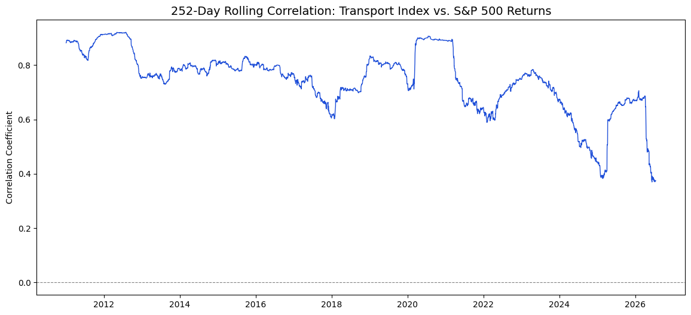
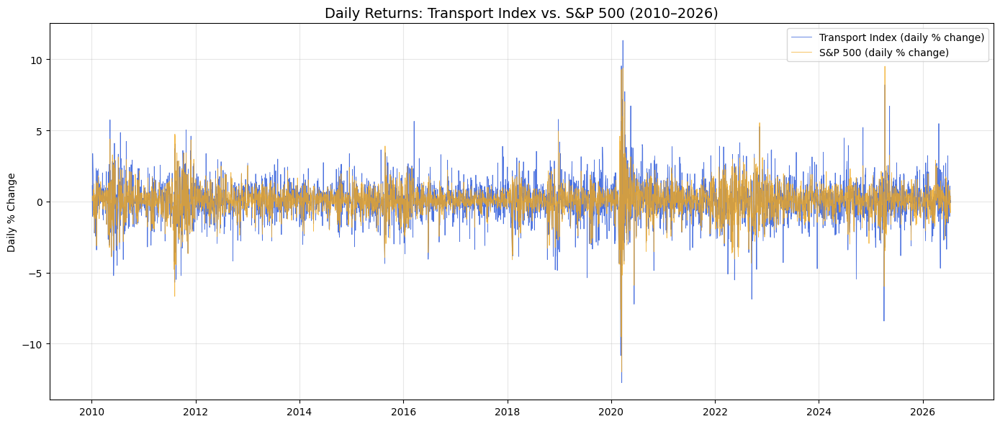

# transport-stocks-lead-indicator
# Do Transport Stocks Lead the Market?
A test of Dow Theory using modern data: Does movement in transport 
stocks (FedEx, UPS, Union Pacific, Norfolk Southern) predict future 
moves in the S&P 500?

## Background
Dow Theory holds that transportation stocks move 
ahead of the broader market since goods must be shipped before 
they're sold. I wanted to test whether this holds up in modern daily 
data.

## Method
- Pulled daily price data (2010–2026) for FDX, UPS, UNP, NSC, and the 
  S&P 500 using Python (`yfinance`)
- Built a normalized transport composite index from the four stocks
- Converted prices to daily returns
- Tested correlation between transport returns and *future* S&P 500 
  returns at four lags: 1 day, 1 week, 1 month, 1 quarter

## Results
| Lag | Correlation |
|-----|-------------|
| 1 day | -0.080 |
| 1 week | 0.031 |
| 1 month | -0.002 |
| 1 quarter | -0.031 |

All correlations were close to zero: No statistically meaningful 
lead-lag relationship was found at any horizon tested.

## Interpretation
This is consistent with efficient markets: if transports reliably 
predicted the broader market, that signal would likely already be 
priced in by other participants.

To look beyond a single average figure, I also plotted a rolling 
correlation between transport and S&P 500 returns over time:

Correlation stayed consistently positive throughout the sample period 
(roughly 0.4–0.9), strengthening during periods of macro stress (e.g. 
2020) and easing during calmer markets — but showed no evidence of a 
lead-lag gap at any point.

The daily returns of both series, overlaid, tell the same story:

The two series move together closely day to day, including matching 
volatility spikes during the 2020 and 2025 selloffs, rather than one 
clearly leading the other.

## Limitations & next steps
- Daily data may be too short-horizon to catch a slower-moving signal. Worth retesting with monthly or quarterly data
- Only tested US large-cap transport stocks; an international angle 
  (e.g. Deutsche Post/DHL) could provide alterior insight
- Correlation doesn't imply causation: Both series may simply react 
  to the same news simultaneously

## Tools
Python, pandas, yfinance, matplotlib, Jupyter Notebook

## Author
Fred Warner — [LinkedIn](https://www.linkedin.com/in/fred-louis-warner) · [GitHub]()

